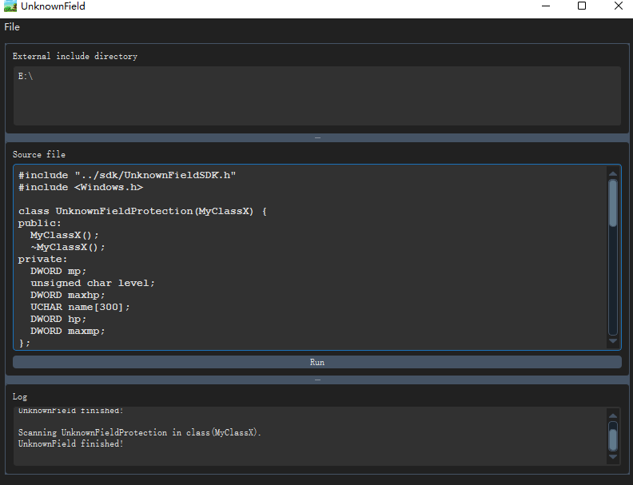
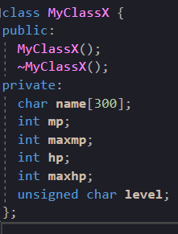
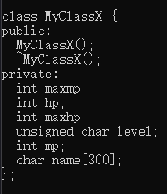

# UnknownField
UnknownField is a tool based clang that obfuscating the order of fields to protect your C/C++ game or code.



## Before


## After


## Usage
```
UnknownField-cli.exe
Usage: UnknownField-cli.exe [options] <source0> [... <sourceN>]

Optional arguments:
-- -I                       - External include directory
-g                          - Enable global obfucation
```

## Example commands:
```bash
UnknownField-cli.exe test.cpp
UnknownField-cli.exe test.cpp -g
UnknownField-cli.exe test.cpp -- -IE:\External\Directory
UnknownField-cli.exe test.cpp -- -IE:\External\Directory1 -IE:\External\Directory2
```

## Example SDK:
```C++
#include "sdk/UnknownFieldSDK.h"
#include <Windows.h>
class UnknownFieldProtection(MyClassX) {
public:
  MyClassX();
  ~MyClassX();
private:
  UCHAR name[300];
  DWORD mp;
  DWORD maxmp;
  DWORD hp;
  DWORD maxhp;
  unsigned char level;
};
```

## Usage Dependency
- Visual Studio with SDK10 (without this you could not include windows.h in your file)

## Build Dependency
- [llvm-msvc](https://github.com/NewWorldComingSoon/llvm-msvc/releases)

## Build
```
git clone --recurse-submodules https://github.com/NewWorldComingSoon/UnknownField.git
cd UnknownField
set LLVM-MSVC-BIN=E:\llvm\llvm-msvc-bin  -> You need to replace your path.
cmake -Bbuild -DLLVM_DIR=%LLVM-MSVC-BIN%\lib\cmake\llvm -DClang_DIR=%LLVM-MSVC-BIN%\lib\cmake\clang
cmake --build build --config Release -- -m
```

## TODO
- Obfuscating the order of virtual functions.

## Note
This project is currently still a demo.
